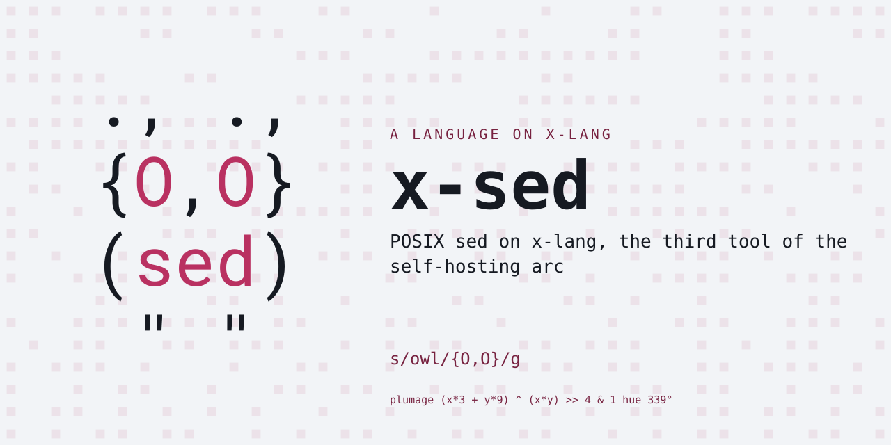

# x-sed

POSIX sed on x-lang, the third tool of the self-hosting arc -- and the
first CROSS-BUNDLE build: `(requires-lang "grep")` arms x-grep as a
library, so the BRE escape-swap translator, the byte doors, the line
splitter and the stdin reclaim all ride in from there.  1,451 sed calls
in the measured build closure (x-lang `docs/bootstrap-closure.md`).

Status: pre-release.  Working: `s///` with any delimiter, `g`/`p`/Nth-
occurrence flags, `&` and `\1`-`\9` backreferences in the replacement
(the regex engine's capture groups), `-E`; addresses -- line numbers,
`$`, `/re/`, two-address ranges, `!` negation; `p` `d` `q` and `{ }`
groups; `-n`; `-e` fragments and `-f` script files; files as one stream
(line numbers continue, `$` is the overall last); status 0/1.  Refused
loudly, recorded as pending: empty-`//` last-regex reuse, the hold
space (h H g G x), multiline (N D P), a/i/c text, y///.

Paired with x-lang v0.9.0 (`lang.xon` is the checkable row); requires
the x-grep bundle beside it (or installed).

## Try it

    make install        # into the x on PATH (install x-grep first)

    x -l sed -- [-nE] [-e script]... [-f scriptfile]... [script] [file]...

    printf 'hello world\n' | x -l sed 's/world/x-lang/'
    x -l sed -- -n '/start/,/end/p' log.txt

The `--` lets sed's own -n/-e/-f/-E through x.sh's parsing; without it,
place options after the script.  The pure core is
`(sed-run ARGV INPUT-TEXT)` -- the suite drives it directly, every
expectation from a real sed run.

## Tests

    make test           # the suite, loud on any failure
    make lint           # this bundle's sources, through x-lang's linter
    make check          # lint, then judged against tests/contract/known-failures.txt

`make lint` shims onto the platform's lang kit and vendors nothing.  It
**skips itself** on an x whose linter cannot arm x-grep -- the lang this
bundle is written on top of -- which is every release up to and including
v0.14.0; before [x-lang#689](https://github.com/jonruttan/x-lang/pull/689)
every file here died as `include: cannot open` before a rule could run.

The first clean sweep paid for itself twice: a five-arm nested-`if` ladder
in `sed/parse.x`, now a `match`, and a dead `(length lines)` in
`sed/exec.x` -- a whole extra pass over the input on every run, read by
nothing.

## Layout

    lang.xon          what this bundle IS -- note (requires-lang "grep")
    run.x             the entry: seam globals, operands mean "be sed"
    sed/parse.x       script text to compiled commands (regexes compile
                      through grep's translator)
    sed/exec.x        the cycle: addresses, ranges, s///, the controls
    sed/cli.x         options, files, stdin, sed-main (the exit)
    tests/            markdown specs + the platform's runner; the harness
                      arms the required grep bundle the way x.sh does
    tests/lint.sh     shims onto the lang kit's linter -- vendors nothing

